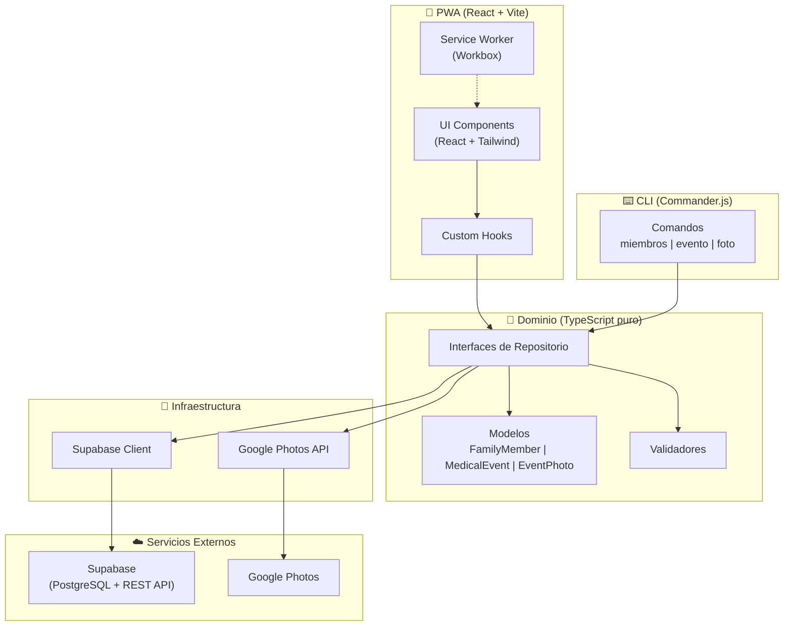

# Diagrama del Sistema — Registro Médico Familiar

## Notas

- **Dominio puro**: Sin dependencias de framework. Los modelos, validadores e interfaces de repositorio son TypeScript puro.
- **CLI con paridad**: Todos los comandos del CLI acceden a la misma lógica de dominio que la UI.
- **Fotos por referencia**: Solo se almacenan URLs/IDs de Google Photos, nunca las imágenes.
- **Sin autenticación**: App de uso familiar privado, sin control de acceso.
