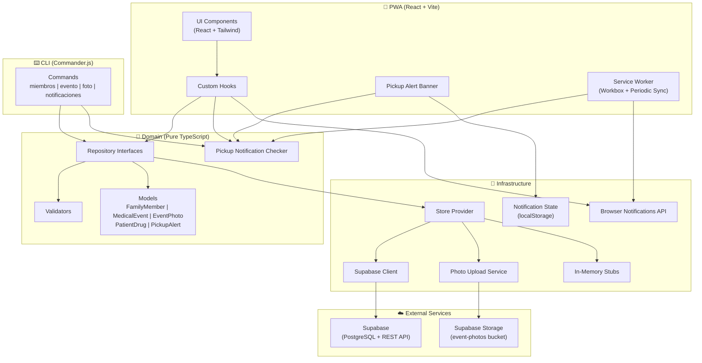

# System Diagram — Family Medical Records

```mermaid
graph TB
    subgraph Client["📱 PWA (React + Vite)"]
        UI["UI Components<br/>(React + Tailwind)"]
        Hooks["Custom Hooks"]
        AlertBanner["Pickup Alert Banner"]
        SW["Service Worker<br/>(Workbox + Periodic Sync)"]
    end

    subgraph Domain["🧠 Domain (Pure TypeScript)"]
        Models["Models<br/>FamilyMember | MedicalEvent | EventPhoto<br/>PatientDrug | PickupAlert"]
        Validators["Validators"]
        Services["Repository Interfaces"]
        NotifChecker["Pickup Notification Checker"]
    end

    subgraph CLI["⌨️ CLI (Commander.js)"]
        Commands["Commands<br/>miembros | evento | foto | notificaciones"]
    end

    subgraph Infra["🔌 Infrastructure"]
        StoreProvider["Store Provider"]
        SupaClient["Supabase Client"]
        PhotoStorage["Photo Upload Service"]
        InMemory["In-Memory Stubs"]
        NotifState["Notification State<br/>(localStorage)"]
        BrowserNotif["Browser Notifications API"]
    end

    subgraph External["☁️ External Services"]
        SupabaseDB["Supabase<br/>(PostgreSQL + REST API)"]
        SupabaseStorage["Supabase Storage<br/>(event-photos bucket)"]
    end

    UI --> Hooks
    Hooks --> Services
    Hooks --> NotifChecker
    AlertBanner --> NotifChecker
    AlertBanner --> NotifState
    Commands --> Services
    Commands --> NotifChecker
    Services --> Validators
    Services --> Models
    Services --> StoreProvider
    StoreProvider --> SupaClient
    StoreProvider --> PhotoStorage
    StoreProvider --> InMemory
    SupaClient --> SupabaseDB
    PhotoStorage --> SupabaseStorage
    SW --> NotifChecker
    SW --> BrowserNotif
    Hooks --> BrowserNotif
```

## Notes

- **Pure Domain**: No framework dependencies. Models, validators, and repository interfaces are pure TypeScript.
- **CLI Parity**: All CLI commands access the same domain logic as the UI.
- **Photo Storage**: Photos are uploaded directly to Supabase Storage. Permanent public URLs are stored in the database.
- **No Authentication**: Private family-use app with no access control.
- **Store Provider**: Auto-selects the real implementation when credentials are configured, falls back to in-memory stubs otherwise.
- **Pickup Notifications**: Client-side alerts for approaching prescription pickups. In-app banner + browser Notification API + Service Worker Periodic Background Sync (Chrome Android).
