# System Diagram — Family Medical Records

```mermaid
graph TB
    subgraph Client["📱 PWA (React + Vite)"]
        UI["UI Components<br/>(React + Tailwind)"]
        Hooks["Custom Hooks"]
        SW["Service Worker<br/>(Workbox)"]
    end

    subgraph Domain["🧠 Domain (Pure TypeScript)"]
        Models["Models<br/>FamilyMember | MedicalEvent | EventPhoto"]
        Validators["Validators"]
        Services["Repository Interfaces"]
    end

    subgraph CLI["⌨️ CLI (Commander.js)"]
        Commands["Commands<br/>miembros | evento | foto"]
    end

    subgraph Infra["🔌 Infrastructure"]
        SupaClient["Supabase Client"]
        GoogleAPI["Google Photos API"]
        InMemory["In-Memory Stubs"]
        StoreProvider["Store Provider"]
    end

    subgraph External["☁️ External Services"]
        Supabase["Supabase<br/>(PostgreSQL + REST API)"]
        GooglePhotos["Google Photos"]
    end

    UI --> Hooks
    Hooks --> Services
    Commands --> Services
    Services --> Validators
    Services --> Models
    Services --> StoreProvider
    StoreProvider --> SupaClient
    StoreProvider --> InMemory
    SupaClient --> Supabase
    GoogleAPI --> GooglePhotos
    SW -.-> UI
```

## Notes

- **Pure Domain**: No framework dependencies. Models, validators, and repository interfaces are pure TypeScript.
- **CLI Parity**: All CLI commands access the same domain logic as the UI.
- **Photos by Reference**: Only Google Photos URLs/IDs are stored, never the actual images.
- **No Authentication**: Private family-use app with no access control.
- **Store Provider**: Auto-selects the real implementation when credentials are configured, falls back to in-memory stubs otherwise.
